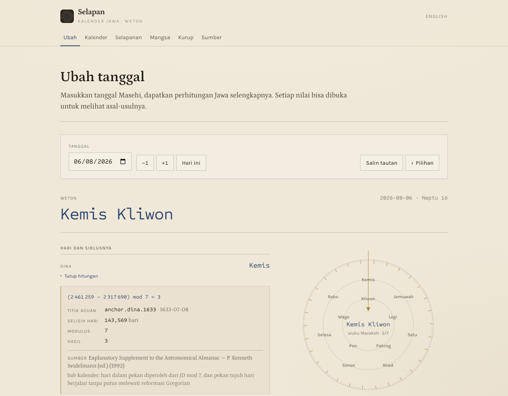
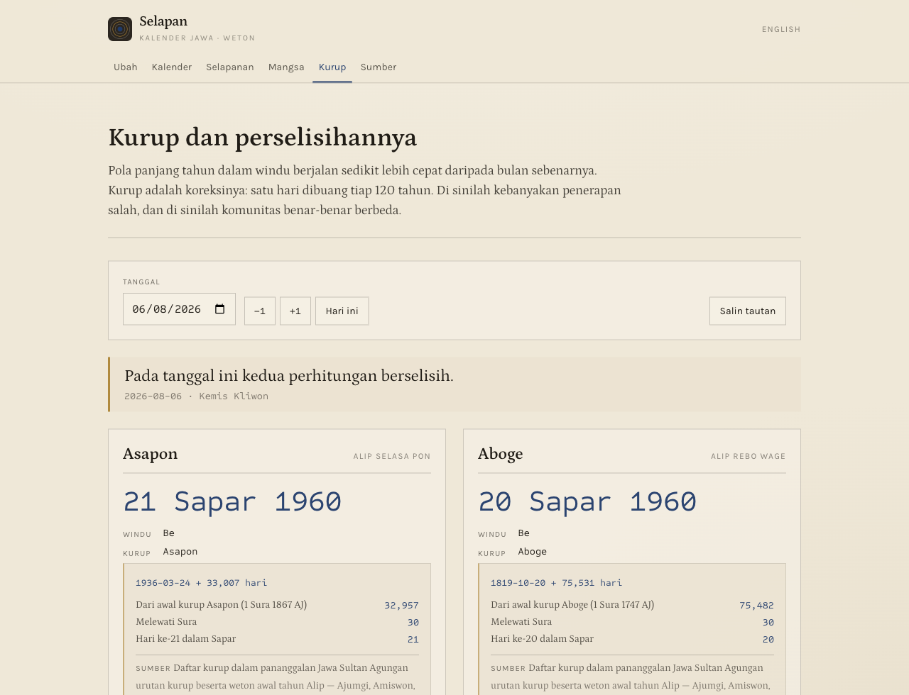
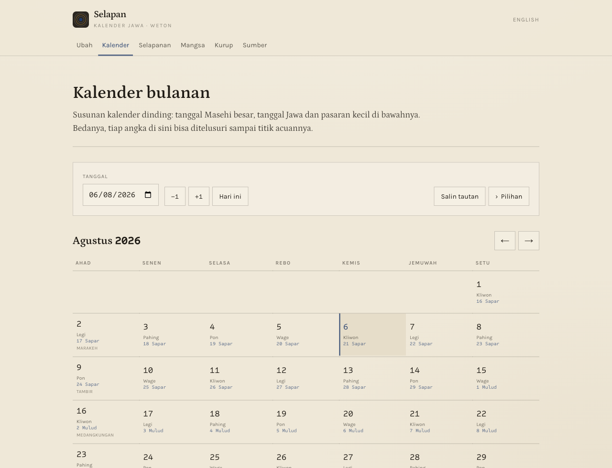

<div align="center">

<picture>
  <source media="(prefers-color-scheme: dark)" srcset=".github/assets/lockup-dark.png">
  
</picture>

**Kalender Jawa, dengan hitungannya diperlihatkan.**

Empat siklus yang berjalan bersamaan, aritmetika yang bisa diperiksa dengan tangan,
kurup yang benar sepanjang sejarah, dan batas tegas antara yang dihitung dan yang diwariskan.

[**→ Buka aplikasinya**](https://andifathulms.github.io/selapan/id/) · [English](https://andifathulms.github.io/selapan/en/) · [Sumber dan yang belum selesai](https://andifathulms.github.io/selapan/id/sumber/)

[](https://github.com/andifathulms/selapan/actions/workflows/deploy.yml)


</div>

> *selapan* — daur 35 hari yang lahir dari pasaran lima hari berjalan melawan pekan tujuh hari. Daur yang dinamai sebuah weton.

---

## Kenapa ini bukan sekadar tabel

Weton tampak seperti pencarian di tabel. Sebenarnya ia empat siklus yang berjalan bersamaan — pasaran lima hari, pekan tujuh hari, wuku 210 hari, dan tahun lunar sejak 1633 M — ditambah sistem koreksi sejarah di atasnya, yaitu **kurup**.

Kebanyakan penerapan salah dengan tiga cara yang bisa ditebak: mereka mematok kurup Asapon sehingga tanggal historis meleset, mereka tetap menghitung tanggal sebelum 1633 M padahal sistemnya belum ada, dan mereka tidak memperlihatkan metode apa pun sehingga kesalahannya tak terdeteksi.

Aplikasi ini memperlihatkan derivasi setiap angka, menolak menghitung di luar rentang yang berlaku, dan menyandingkan **Aboge** dan **Asapon** alih-alih memilih salah satu.

## Tampilannya

**Setiap nilai bisa dibuka: titik acuan, selisih hari, modulus, hasil, dan kutipan sumbernya.**



**Aboge dan Asapon berdampingan, dengan mekanisme yang memisahkan keduanya.**
Inilah sebabnya Idul Fitri di desa Aboge kadang jatuh sehari setelah penetapan nasional.



**Susunan kalender dinding, tapi tiap angka bisa ditelusuri sampai titik acuannya.**



## Cara kerjanya

```
tanggal Masehi
  → JDN (bilangan bulat)
  → siklus (murni)  → pasaran, dina, wuku       [tanpa batas]
  → lunar (murni)   → kurup → windu → tahun → bulan → tanggal  [sejak 1633 M]
  → CalendarTrace   → cincin | konversi | kalender
```

Tiga hal menentukan segalanya:

1. **Yang dihitung dan yang ditafsirkan dipisah tegas**, di kode maupun di warna. Nila untuk aritmetika, merah rubrik untuk bahan primbon. Tidak pernah dicampur.
2. **JDN adalah representasi internal.** Bilangan bulat, modulo terhadap anchor bersumber. Tidak ada objek `Date` di dalam mesin — tidak ada zona waktu, tidak ada DST, tidak ada locale.
3. **Rentang keberlakuan berbeda per subsistem.** Siklus 5, 7, dan 210 hari kontinu tanpa batas. Sistem tahun lunar mulai 1633 M dan tidak berarti apa pun sebelum itu. Di luar rentang, mesin menolak — bukan mengekstrapolasi.

Tumpukannya: Next.js 14 (`output: 'export'`), TypeScript `strict`, Tailwind, Zod, Vitest, pnpm. **Tanpa pustaka tanggal** — JDN adalah aritmetika bilangan bulat, dan sebuah pustaka justru akan menyelundupkan semantik zona waktu yang keliru di sini.

## Yang sudah ada

| | |
|---|---|
| **M0** Scaffold | Ekspor statis, konversi JDN, skema anchor + validator build |
| **M1** Siklus | Pasaran, dina, weton, neptu, wuku dari anchor bersumber |
| **M2** Tahun lunar | Windu, panjang bulan, kurup, Aboge/Asapon, rentang keberlakuan |
| **M3** Antarmuka | Cincin siklus, konversi dengan derivasi, kalender bulanan |
| **M4** Perselisihan | Aboge dan Asapon berdampingan, halaman sumber |
| **M5** Mangsa | Pranata mangsa, selapanan, hitungan slametan |
| **M6** Primbon | **Belum dirilis** — menunggu peninjau (PRD §10) |

M6 sengaja ditahan. Mesin kalendernya berdiri sendiri sebagai produk yang utuh; lapisan tafsir butuh peninjau yang paham praktik pananggalan Jawa. Skema dan pemeriksa build untuk lapisan itu sudah ada dan sudah berlaku: tiap entri wajib bersumber, wajib beratribusi “Menurut …”, dan ditolak saat build bila memakai sapaan orang kedua atau mengandung peringkat.

## Menjalankan

```bash
pnpm install
pnpm dev                    # http://localhost:3000/selapan/id/

pnpm build                  # ekspor statis ke ./out; menjalankan data:validate dulu
pnpm preview                # sajikan ./out
pnpm test:run               # sebelum setiap commit
pnpm test:cycles            # invarian periode siklus sepanjang satu abad
pnpm test:anchors           # fixture anchor bersumber
pnpm test:kurup             # batas kurup, perselisihan Aboge/Asapon
pnpm data:validate          # skema dan kelengkapan kutipan — menggerbangi build
pnpm typecheck
pnpm lint
```

`pnpm data:validate` menggerbangi build dan CI. Jangan dilemahkan.

`main` dibangun dan dideploy lewat GitHub Actions. `basePath` harus sama dengan nama repositori; ia muncul di `next.config.js` dan di `public/manifest.webmanifest`, jadi keduanya berubah bersama bila repo ini pernah diganti nama.

## Pengujian

Sekitar **126 uji**. Yang paling berguna adalah invarian siklus sepanjang puluhan ribu hari berturut-turut: kesalahan satu hari pada sebuah anchor langsung terlihat sebagai periode yang rusak atau nilai yang berulang, tanpa perlu oracle dari luar.

Uji silang yang paling meyakinkan ada di `tests/kurup`: berangkat dari satu anchor 1633 dan menerapkan pola windu beserta koreksi 120 tahun, rantai kurup mendarat berturut-turut pada Kemis Kliwon, Rebo Wage, dan Selasa Pon — nama Amiswon, Aboge, dan Asapon — dengan Asapon jatuh pada 24 Maret 1936, tanggal yang tercatat sumber. Empat nama dan satu tanggal Masehi tereproduksi dari satu anchor; itu bukan kebetulan aritmetika.

## Yang belum selesai

Daftar terbuka, juga tersedia di halaman [**Sumber**](https://andifathulms.github.io/selapan/id/sumber/) aplikasi. Menerbitkannya adalah bagian dari maksud proyek ini.

- **Epoch pawukon** bersandar pada satu sumber dan belum diadu dengan kalender Bali maupun Jawa cetak. Fase yang meleset satu wuku tidak akan tertangkap uji invarian mana pun. Nilai wuku dirender abu-abu. *Ini tugas paling berharga berikutnya.*
- **Kurup Anenhing** (1987 AJ, mulai 2052 M) adalah proyeksi, bukan catatan.
- **Panjang bulan tahun Dal** dalam tradisi Surakarta tidak beraturan dan belum diterapkan. Batas tahun tidak terpengaruh; tanggal di dalam tahun Dal bisa meleset.
- **Kurup pertama berjalan 72 tahun**, bukan 120. Sebab historisnya tidak dicatat di sini; yang bisa ditegaskan hanya bahwa panjang itulah yang membuat rantai kurup berikutnya mendarat tepat.
- **Sumber dikutip sebagai tradisi pananggalan**, belum sebagai halaman almanak cetak yang ditranskripsi.

## Struktur

```
app/[locale]/     ubah · kalender · kurup · mangsa · selapanan · sumber   (id, en)
components/       wheels · trace · grid · controls · chrome
lib/jdn/          Masehi ↔ JDN. Bilangan bulat saja.
lib/cycles/       pasaran, dina, weton, wuku, neptu. Tanpa batas.
lib/lunar/        windu, tahun, bulan, kurup. Sejak 1633 M.
lib/trace/        tipe CalendarTrace, langkah derivasi
lib/range/        keberlakuan per subsistem + penolakan terstruktur
data/             anchor · kurup · mangsa · primbon — tiap entri bersumber
tests/            anchors · cycles · kurup · range · jdn · trace · mangsa · selapanan
```

Baca `PRD.md` untuk lingkup dan `CLAUDE.md` untuk cara bekerja di repo ini.

## Berkas merek

Master merek ada di `exports/` dan **tidak ikut di-commit** — folder itu berisi banyak varian dan ukuran. Yang benar-benar dipakai situs sudah ada di dalam repo: `app/icon.svg`, `app/apple-icon.png`, `app/opengraph-image.png`, dan `public/icons/` untuk manifest.

Dua aturan merek yang mengikat: emas hanya untuk cincin milik piringan itu sendiri, tidak pernah sebagai aksen umum; dan nila disediakan untuk nilai terhitung.

## Lisensi dan sikap

Proyek pribadi, sumber terbuka, bukan otoritas. Tradisi pananggalan berbeda antar-daerah, dan aplikasi ini tidak dimaksudkan membantah perhitungan yang dipakai keluarga atau komunitas mana pun. Bahan primbon, bila kelak dirilis, disajikan sebagai dokumentasi budaya — bukan ramalan, bukan nasihat, tanpa peringkat, dan selalu beratribusi.

<div align="center">

Dirancang dan dibangun oleh [Andi Fathul Mukminin](https://andifathulms.github.io/en/)

</div>
